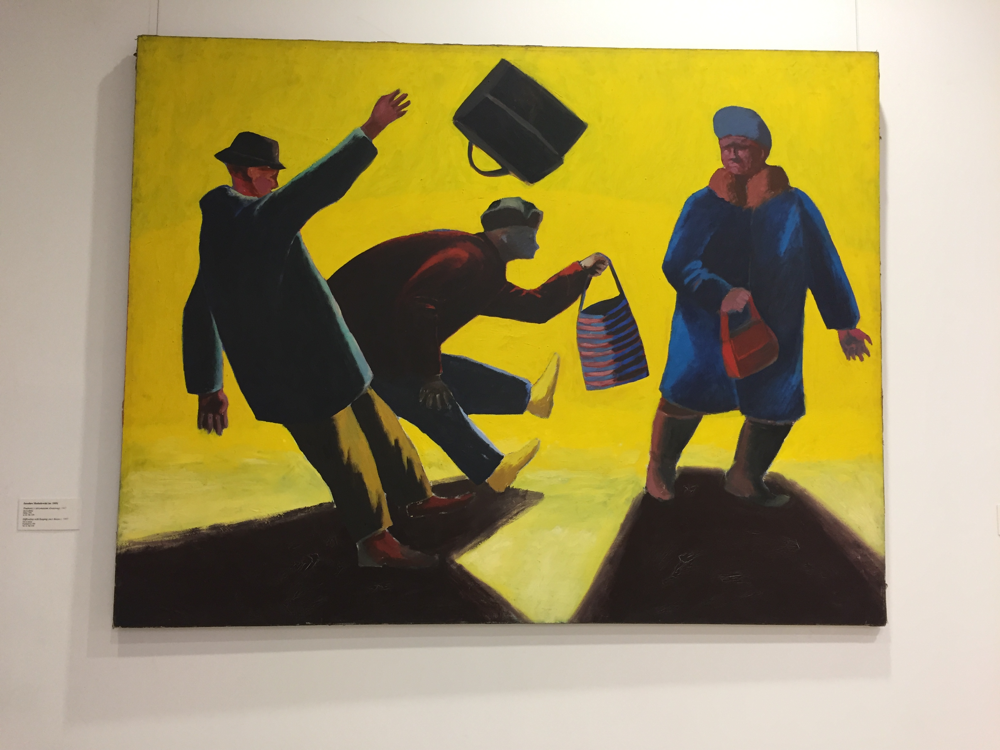
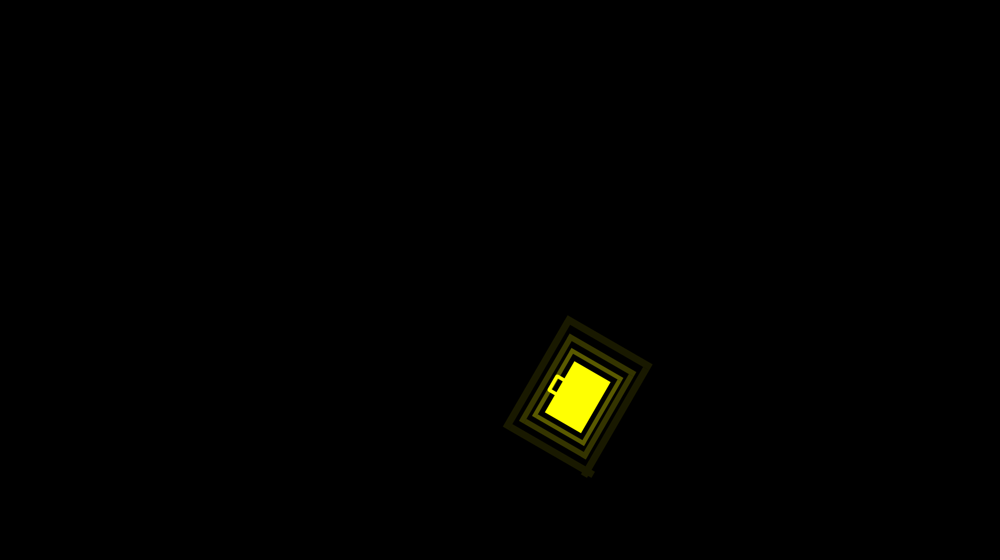
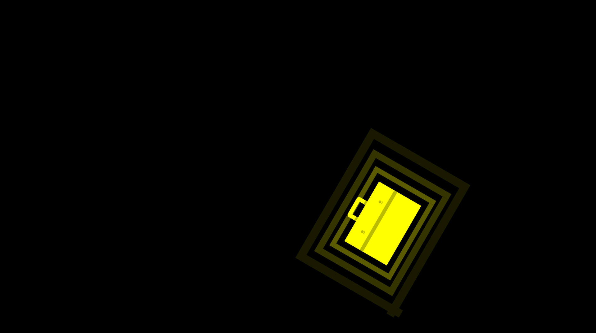
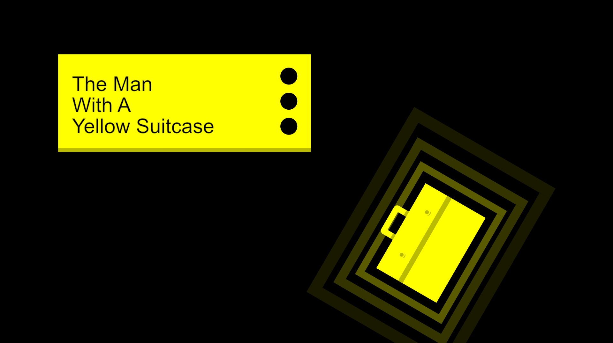
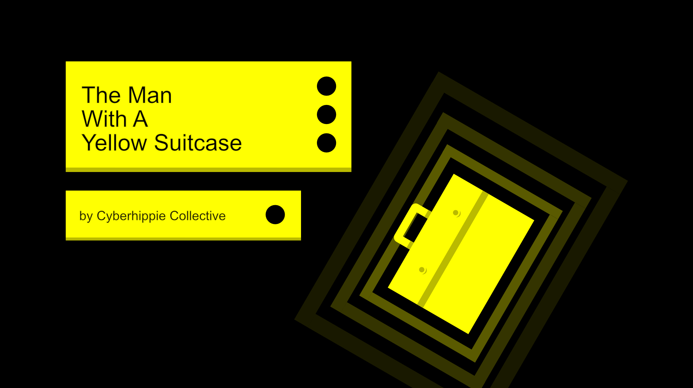
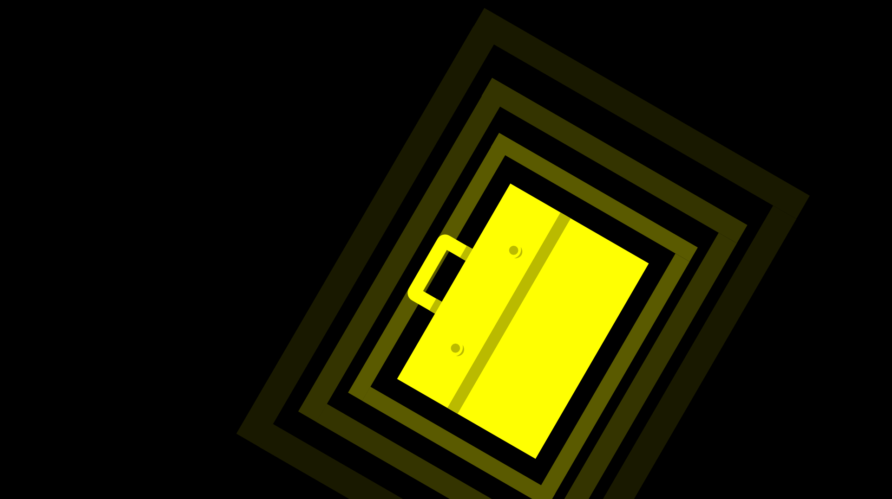
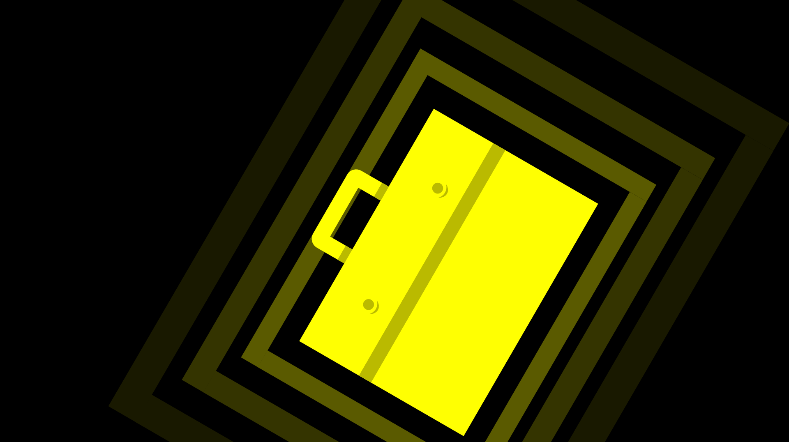
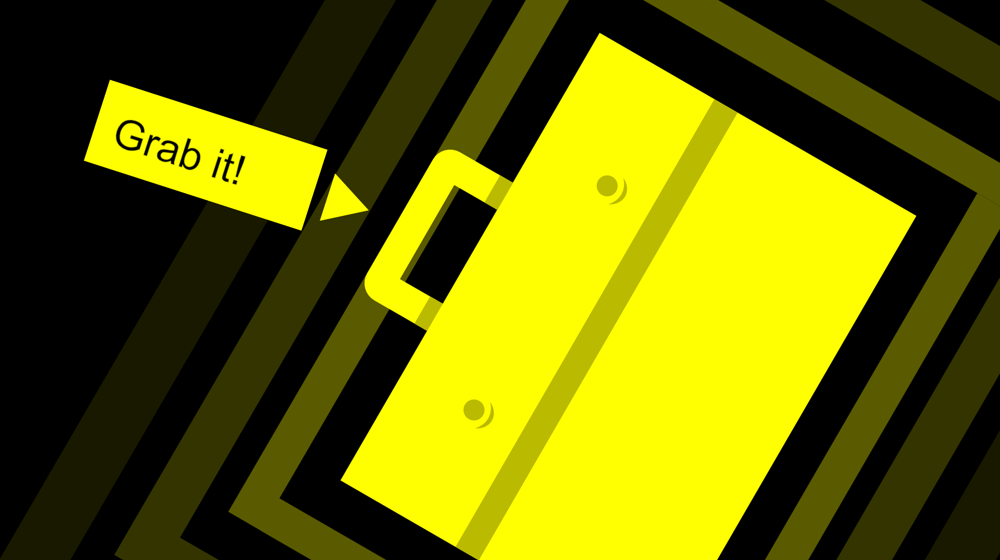
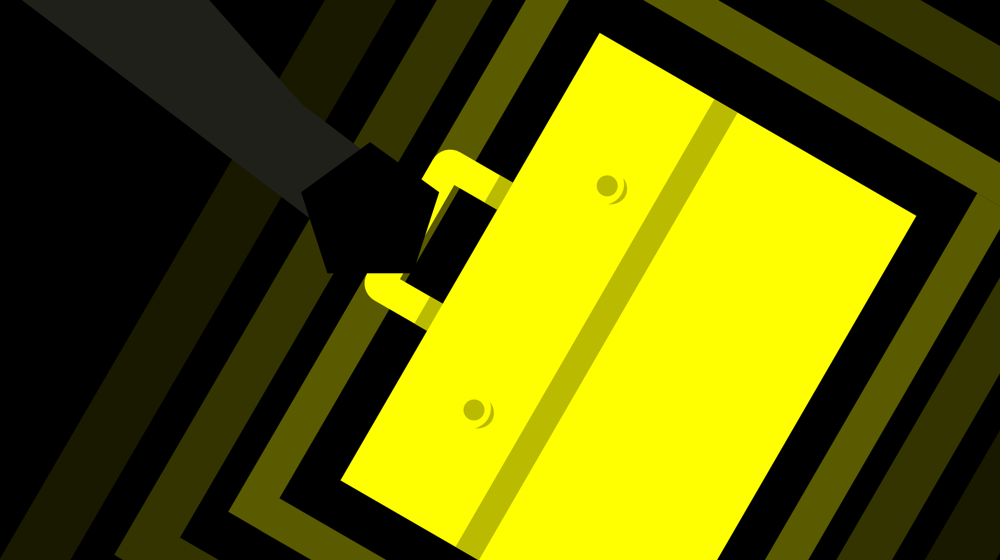

<a name="intro"></a>
# THE MAN WITH A YELLOW SUITCASE
Description.

Initial inspiration:


Intro Storyboard:













Description.


Description.


### Table of Contents
1. [Introduction.](#intro)
2. [Features.](#features)
3. [Icebox.](#icebox)
4. [Installation and usage guide.](#install)
5. [Contributing.](#contribute)
6. [License.](#license)
7. [Credits.](#credits)

<a name="features"></a>
### Features
+ Feature_01
+ Feature_02
+ Feature_03

<a name="icebox"></a>
### Icebox
+ Idea_01
+ Idea_02
+ Idea_03

<a name="install"></a>
### Installation and Usage Guide
Include basic necessary components. Gifs if required.
```
1. 
2. 
3. 
```

<a name="contribute"></a>
### Contributing
Insert project contribution rules if allowed.

<a name="license"></a>
### License
Insert project licensing options if there are any.

<a name="credits"></a>
### Credits
Insert project creator entities, contributors and their respective presence links.
